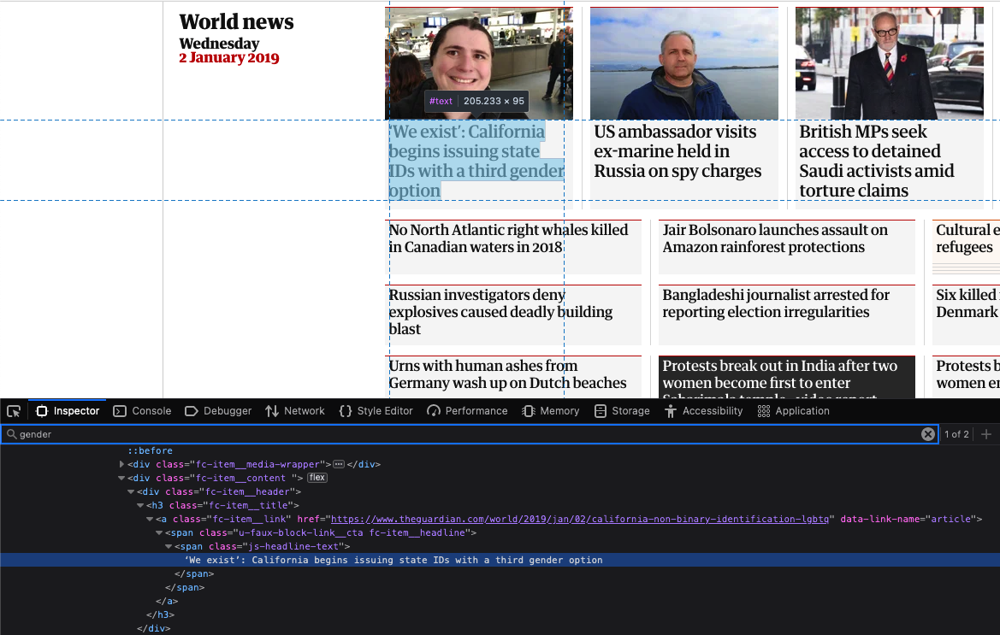

# Analyzing The Guardian’s headlines using web scrapping
## A report on world politics and the Coronavirus Pandemic.


### Introduction and Context:
In this project we wanted to have access to all the headlines from the British newspaper “The Guardian” to analyze the presence of certain keywords over time. The Guardian is one of the most read newspapers online, and it is interesting to see in which topics their news focus over a period of time. This can help us understand the public interest in certain news, for instance, how often are the terms “vaccine” or “climate” used in headlines over time? Moreover, newspaper not only reflect the world but they also influence it, be it deliberately or not. For instance, one newspaper can decide to talk more about an armed conflict in order to increase their readers awareness about it. Also, a dataset of headlines can be used for marketing, investments or even used during elections to understand voters’ intentions or preferences. It is out of the scope of this assignment, but with machine learning tools, companies, traders of the stock market, or political parties can build models to predict outcomes and adjust their behaviours based on them. This includes techniques such as sentiment analysis, which could be used to extract more information about the headlines.

### Context
The Guardian's newspaper has an archive of its news available online. We are interested in extracting the headlines of each day for a period of time, to create a dataset for further analysis. The information we want to extract is, as we can see from this screenshot from the 2nd of January, inside an h3 header.



### Web Scrapper Code:
For this project we have built a github repository which consists on few modules that help extract data from the newspaper “The Guardian”. The code is written in a modular way and could be easily adapted if we wanted to analyze headlines of other newspapers, but to some extend it is specific to The Guardian web structure.
A part from this report (or Readme file), the code is documented and commented to be easy to understand and follow the different steps, pelase check the documentation.

#### Installation
To install The Guardian newspaper analyzer clone this repository into your local machine, or just download it from github.

```bash
git clone https://github.com/ulisesrey/the_guardian_scraper
```

Follow [this tutorial](https://docs.github.com/en/repositories/creating-and-managing-repositories/cloning-a-repository) if you are not familiar with the process.


#### Execution
Once the repository has been downloaded, execute the main script to extract the headlines between two dates. For example, to extract the headlines between the 1st of October 2024 and the 1st of November 2024 we would write:
```bash
main.py -start 2024-10-27 -end 2024-11-01 -o dataset/my_dataset.csv
```
The first two inputs to the main.py script are the initial date, and end date. The third input is the filepath where the data will be saved.

#### Output
When successfully run the script, you will generate the output file in the specified path. You should also see something like this in your terminal:
```
2024-11-11 16:15:14,058 - INFO - Using User-Agent: Mozilla/5.0 (Macintosh; Intel Mac OS X 10_15_7) AppleWebKit/537.36 (KHTML, like Gecko) Chrome/108.0.0.0 Safari/537.36
2024-11-11 16:15:14,247 - INFO - Found 18 headlines for 2024/oct/27
Scraping date: 2024-10-28
2024-11-11 16:15:14,561 - INFO - Using User-Agent: Mozilla/5.0 (Macintosh; Intel Mac OS X 11_3) AppleWebKit/537.36 (KHTML, like Gecko) Chrome/109.0.5412.99 Safari/537.36
2024-11-11 16:15:14,754 - INFO - Found 25 headlines for 2024/oct/28
Scraping date: 2024-10-29
2024-11-11 16:15:15,240 - INFO - Using User-Agent: Mozilla/5.0 (Macintosh; Intel Mac OS X 10_15_7) AppleWebKit/605.1.15 (KHTML, like Gecko) Version/14.0.3 Safari/605.1.15
2024-11-11 16:15:15,461 - INFO - Found 32 headlines for 2024/oct/29
Scraping date: 2024-10-30
2024-11-11 16:15:15,529 - INFO - Using User-Agent: Mozilla/5.0 (Macintosh; Intel Mac OS X 10_15_7) AppleWebKit/605.1.15 (KHTML, like Gecko) Version/14.0.3 Safari/605.1.15
2024-11-11 16:15:15,745 - INFO - Found 40 headlines for 2024/oct/30
Scraping date: 2024-10-31
2024-11-11 16:15:16,373 - INFO - Using User-Agent: Mozilla/5.0 (Macintosh; Intel Mac OS X 10_10) AppleWebKit/537.36 (KHTML, like Gecko) Chrome/108.0.5361.172 Safari/537.36
2024-11-11 16:15:16,564 - INFO - Found 34 headlines for 2024/oct/31
Scraping date: 2024-11-01
2024-11-11 16:15:16,747 - INFO - Using User-Agent: Mozilla/5.0 (Windows NT 10.0; Win64; x64) AppleWebKit/537.36 (KHTML, like Gecko) Chrome/91.0.4472.124 Safari/537.36
2024-11-11 16:15:16,915 - INFO - Found 30 headlines for 2024/nov/01
Data collection completed and saved to dataset/my_dataset.csv
```
Two files are created after the execution, the dataset itself, found on dataset folder, and the log, in the logs folder.

To learn more about the Dataset check the section "Dataset" below.

#### Code Summary
The main.py script, takes the two specified dates and calls the function scrape_guardian_headlines() from the scrape_guardian.py module.

There are two important features of the scrape_guardian.py module that have been designed to avoid prevention of web scrapping.

**Random Agent**

Everytime the code scraps the The Guardian website it does so with a different Agent header. This is done to avoid the website detecting the same Agent scrapping the website and blocking it, for example with an 403 Error: Forbidden.
```python
# We define some agents, so we can scrap with different agents later
USER_AGENTS = [
    "Mozilla/5.0 (Windows NT 10.0; Win64; x64) AppleWebKit/537.36 (KHTML, like Gecko) Chrome/91.0.4472.124 Safari/537.36",
    "Mozilla/5.0 (Macintosh; Intel Mac OS X 10_15_7) AppleWebKit/605.1.15 (KHTML, like Gecko) Version/14.0.3 Safari/605.1.15",
    "Mozilla/5.0 (Windows NT 10.0; Win64; x64) AppleWebKit/537.36 (KHTML, like Gecko) Firefox/89.0",
    'Mozilla/5.0 (Macintosh; Intel Mac OS X 10_15_7) AppleWebKit/537.36 (KHTML, like Gecko) Chrome/108.0.0.0 Safari/537.361675787110',
    'Mozilla/5.0 (Macintosh; Intel Mac OS X 11_3) AppleWebKit/537.36 (KHTML, like Gecko) Chrome/109.0.5412.99 Safari/537.36',
    'Mozilla/5.0 (Macintosh; Intel Mac OS X 10_10) AppleWebKit/537.36 (KHTML, like Gecko) Chrome/108.0.5361.172 Safari/537.36',
    'Mozilla/5.0 (X11; Linux i686) AppleWebKit/537.36 (KHTML, like Gecko) Chrome/109.0.5388.177 Safari/537.36',
    'Mozilla/5.0 (Macintosh; Intel Mac OS X 11_14) AppleWebKit/537.36 (KHTML, like Gecko) Chrome/109.0.5397.215 Safari/537.36'
]   

```
And later in the code we choose a random agent from our list with random.choice:
```python
# Define a user agent to avoid 403 error
headers = {'User-Agent': random.choice(USER_AGENTS)}
```

**Random time Sleep**
We also added a random time sleep, to mimic human behavior. The idea is that bots would send a request at fixed intervals and the web administrator can easily block them. To look more like human requests we can use a random time sleep.
```python
# Add a random delay to mimic human behavior
time.sleep(random.uniform(0, 1))  # Random delay between 0 and 1 seconds
```

With all this, we were able to scrap The Guardian for all the day headlines for a period of almost 4 years without being blocked.

### Dataset:
This web scraper can be used for multiple purposes. In this project we wanted to analyze the presence of some keywords for a specific time period, ranging from begining of 2019 to November 2024. The generated dataset has been uploaded to ZENODO with a License CC BY-SA 4.0, and is free to download via this link. It contains all the headlines of the newspaper The Guardian between the dates 2019-01-01 to 2024-11-01.

Its DOI is the following: https://doi.org/10.5281/zenodo.14066041

It looks like this:
```
date,headline
2019-01-01,Jair Bolsonaro takes office as Brazil’s president – in pictures
2019-01-01,Indonesia landslide on New Year's Eve leaves 15 dead and 20 missing
2019-01-01,Terrawatch: landslide tsunami lessons from Anak Krakatau
2019-01-01,Mali attack: 37 civilians killed in armed raid on village
```


### Analysis and Results
As mentioned in the introduction, such a headline dataset is very powerful and can have multiple uses. For this project we will use our dataset to try to answer this questions:
1) Which president of the United States made it more often to The Guardian's headlines, Trump or Biden? What was the temporal evolution of it?
2) What is the temporal evolution of the PM's in the U.K. appearance in the headlines? Who appeared the most?
3) Which vaccine producing companies hit the headlines more often?
4) What is The Guardian's coverage of ongoing military conflicts, like the ones in Sudan, Ukraine or Gaza?


You can visualize the results in the notebook under source, but for this report we also attach some graphs which try to answer the questions we had.
#### 1) Which president of the United States made it more often to The Guardian's headlines, Trump or Biden? What was the temporal evolution of it?
In the following image we clearly see that during his presidency Donald Trump made it more often to the headlines.


#### 2) What is the temporal evolution of the PM's in the U.K. appearance in the headlines? Who appeared the most?
We see that Boris Johnson made it more than anyone else in to the headlines.


#### 3) Which vaccine producing companies hit the headlines more often?
AstraZeneca was the most popular vaccine, altough Pfizer was a fore-runner.


#### 4) What is The Guardian's coverage of ongoing military conflicts, like the ones in Sudan, Ukraine or Gaza?
We see that the conflict with a wider Coverage has been Ukraine, but Gaza surpassing it after October 2023 or being very close.


### Autorship:
The sole author of the code in this repository as well as the creator of the dataset is Ulises Rey, student of the Master in Data Science at the Universitat Oberta de Catalunya (UOC), for the PR1 of Tipologia i cicle de vida de les dades.


## Bibliography

    Lawson, R. (2015). Web Scraping with Python.
    Penman, R.(2015) Web Scrapping with Python: Successfully Scrape Data from Any Website with the Power of Python (https://ebookcentral.proquest.com/lib/bibliouocsp-ebooks/detail.action?docID=4191102)
    User Agent and Web Scrapping. https://www.zenrows.com/blog/user-agent-web-scraping